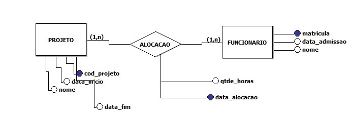

# Etapa 2 - Introdução a conceitos de banco de dados e backend

Essa etapa tem por objetivo introduzir conceitos de banco de dados e backend

## Glossário

### Relacionados ao seu repositório pessoal

- `Seu diretório desta etapa`: diretório correspondente à etapa desta semana do tutorial no seu repositório (`02_TUTORIAL/Semana 2`).

### Relacionados ao repositório dos professores

- `Este diretório`: diretório apresentado nesta página, correspondente a todos os arquivos disponibilizados à etapa desta semana do tutorial (`TUTORIAL_M2/SEMANA_02/02_TUTORIAL`).

## Preparação

A ideia é a de criar o modelo físico do banco de dados chamado projeto.db, com base no seguinte modelo de entidade-relacionamento:



Observar que esse modelo refletirá o seguinte modelo físico, já contando com algumas inserções para facilitar a requisição:

    BEGIN TRANSACTION;
    CREATE TABLE IF NOT EXISTS "projeto" (
        "cod_projeto"	INTEGER NOT NULL,
        "nome"	char(255),
        "data_inicio"	char(10),
        "data_fim"	char(10),
        PRIMARY KEY("cod_projeto" AUTOINCREMENT)
    );
    CREATE TABLE IF NOT EXISTS "usuario" (
        "cod_usuario"	integer NOT NULL,
        "matricula"	integer(11) NOT NULL UNIQUE,
        "data_admissao"	char(10) NOT NULL,
        "nome"	char(128) NOT NULL,
        PRIMARY KEY("cod_usuario" AUTOINCREMENT)
    );
    CREATE TABLE IF NOT EXISTS "alocacao" (
        "cod_alocacao"	integer NOT NULL,
        "cod_projeto"	INTEGER,
        "cod_usuario"	INTEGER,
        "qtde_horas"	INTEGER,
        "data_alocacao"	TEXT,
        PRIMARY KEY("cod_alocacao" AUTOINCREMENT),
        FOREIGN KEY("cod_usuario") REFERENCES "usuario"("cod_usuario"),
        FOREIGN KEY("cod_projeto") REFERENCES "projeto"("cod_projeto")
    );
    INSERT INTO "projeto" VALUES (1,'Projeto 1','2022-04-01','2022-06-01'),
    (2,'Projeto 2','2022-05-01','2022-08-01');
    INSERT INTO "usuario" VALUES (1,1234,'2020-01-01','Funcionário 1'),
    (2,1235,'2018-12-01','Funcionário 2');
    INSERT INTO "alocacao" VALUES (1,1,1,20,'2022-05-01'),
    (2,1,2,100,'2022-06-01'),
    (3,2,1,50,'2022-06-30');
    COMMIT;

Para criar o banco chamado projeto.db, é preciso utilizar a aplicação DB Browser for SQLite e seguir os passos:

1. Arquivo > Novo banco de dados
2. Escolher a pasta 02_TUTORIAL da SEMANA_02 para salvar com o nome projeto.db
3. Na aba Executar SQL, coiar todo o SQL fornecido, desde BEGIN TRANSACTION até COMMIT e executar
4. A partir desse momento você terá o banco de dados criado e com alguns registros


## Instruções para o teste via end points no backend

1. Na mesma pasta em que estiver o arquivo projeto.db, crie uma outra chamada backend
2. Ainda na pasta backend, crie o arquivo com o nome app_21.js, contendo o seguinte trecho de código:

```
    const express = require('express'); 
    const app = express();

    const hostname = '127.0.0.1';
    const port = 3021;
    const sqlite3 = require('sqlite3').verbose();
    const DBPATH = 'projeto.db';

    app.use(express.json());

    /* Definição dos endpoints */

    // Retorna todos registros de usuários
    app.get('/usuarios', (req, res) => {
        res.statusCode = 200;
        res.setHeader('Access-Control-Allow-Origin', '*'); // Isso é importante para evitar o erro de CORS

        var db = new sqlite3.Database(DBPATH); // Abre o banco
    var sql = 'SELECT matricula, nome, strftime("%d/%m/%Y",data_admissao) AS "data de contratação" FROM usuario ORDER BY nome COLLATE NOCASE';
        db.all(sql, [],  (err, rows ) => {
            if (err) {
                throw err;
            }
            res.json(rows);
        });
        db.close(); // Fecha o banco
    });

    // Retorna todos registros de projetos
    app.get('/projetos', (req, res) => {
        res.statusCode = 200;
        res.setHeader('Access-Control-Allow-Origin', '*'); // Isso é importante para evitar o erro de CORS

        var db = new sqlite3.Database(DBPATH); // Abre o banco
    var sql = 'SELECT nome, strftime("%d/%m/%Y",data_inicio) AS "data de início", strftime("%d/%m/%Y",data_fim) AS "data de término" FROM projeto ORDER BY nome COLLATE NOCASE';
        db.all(sql, [],  (err, rows ) => {
            if (err) {
                throw err;
            }
            res.json(rows);
        });
        db.close(); // Fecha o banco
    });

    // Retorna todos registros de alocações
    app.get('/alocacoes', (req, res) => {
        res.statusCode = 200;
        res.setHeader('Access-Control-Allow-Origin', '*'); // Isso é importante para evitar o erro de CORS

        var db = new sqlite3.Database(DBPATH); // Abre o banco
    var sql = "SELECT  strftime('%d/%m/%Y',data_alocacao) AS 'data de alocação', projeto.nome, usuario.nome, qtde_horas \
                FROM alocacao \
                INNER JOIN projeto ON alocacao.cod_projeto = projeto.cod_projeto  \
                INNER JOIN usuario ON alocacao.cod_usuario = usuario.cod_usuario  \
                ORDER BY projeto.nome";
        db.all(sql, [],  (err, rows ) => {
            if (err) {
                throw err;
            }
            res.json(rows);
        });
        db.close(); // Fecha o banco
    });


    /* Inicia o servidor */
    app.listen(port, hostname, () => {
    console.log(`Server running at http://${hostname}:${port}/`);
    });
```

3. No seu terminal,  `node .\backend\app_21.js`, e você perceberá que faltam instalar duas dependências, express e sqlite3, portanto execute o comando npm install express e depois npm install sqlite3.

4. Depois de executar, você perceberá que no console é mostrado "Server running at http://127.0.0.1:3021/", o que significa que é preciso abrir o endereço no navegador.

5. Se você fizer isso, irá receber a mensagem de erro Cannot GET / . Isso ocorre porque não existe um end point apontando para / , e por esse motivo você precisará acessar pelos seguintes endereços:
    - http://localhost:3021/usuarios (listagem dos usuários)
    - http://localhost:3021/projetos (listagem dos projetos)
    - http://localhost:3021/alocacoes (listagem das alocações dos usuários nos projetos)

6. Observe como as consultas foram construídas, e procure executar algumas novas, como por exemplo para obter a somatória da carga horária de alocação por usuário nos projetos.


> Os  endpoints criados em `app_21.js` serão testados durante a instrução.

**Caso não tenha conseguido conseguido executar algum ponto conforme aqui indicado, tire suas dúvidas com o instrutor de programação :)**
