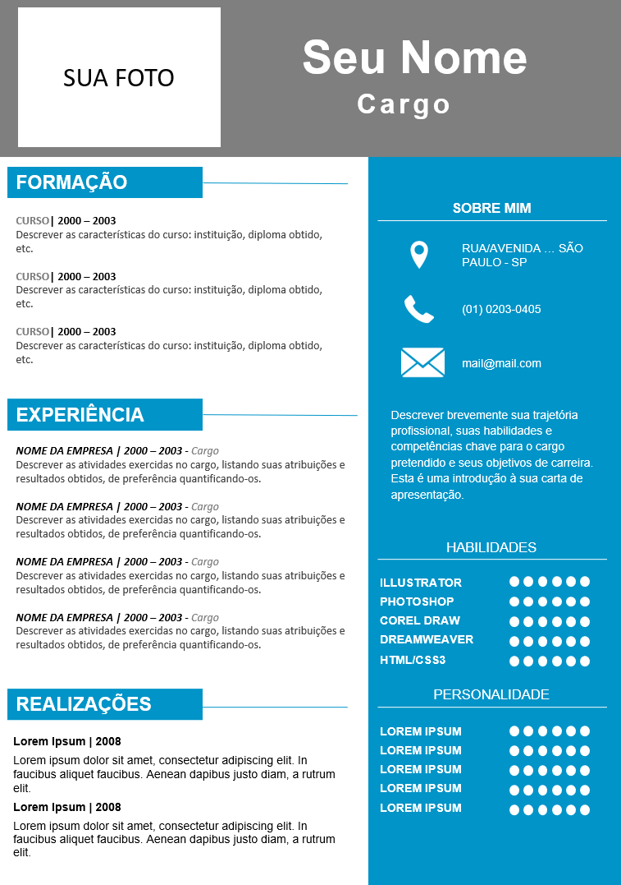

# Exercício para entrega na SEMANA 4 - referente ao conteúdo trabalhado na etapa 3 (`SEMANA_03/01_TUTORIAL`)

## Descrição
Até este momento, pelo fato de não estarmos construindo o frontend de seu currículo, é preciso apresentar uma base sólida na camada de persistência, através da criação das consultas (SELECT) para todas as áreas.

Vamos relembrar a estrutura apresentada na SEMANA 2:

<p style="text-align: center;"></p>

Por exemplo, uma possível consulta seria:

```sql
    SELECT titulo, descricao, data_inicio, data_fim FROM formacao ORDER BY data_fim DESC;
```
De acordo com a sua estrutura física do banco de dados, crie todas as consultas necessárias e as materialize por meio dos endpoints no arquivo app.js (que deve ser criado). Utilize para começar o exemplo a seguir, e não se esqueça dos demais endpoints, como experiencias, realizacoes e dadospessoais:

```node
    const express = require('express'); 
    const app = express();

    const hostname = '127.0.0.1';
    const port = 3000;
    const sqlite3 = require('sqlite3').verbose();
    const DBPATH = 'curriculo.db'; //use o nome que você achar melhor para o banco de dados

    app.use(express.json());
    app.get('/formacao', (req, res) => {
        res.statusCode = 200;
        res.setHeader('Access-Control-Allow-Origin', '*'); 
        var db = new sqlite3.Database(DBPATH); // Abre o banco
        var sql = 'SELECT titulo, descricao, data_inicio, data_fim FROM formacao ORDER BY data_fim DESC';
        db.all(sql, [],  (err, rows ) => {
            if (err) {
                throw err;
            }
            res.json(rows);
        });
        db.close(); // Fecha o banco
    });
```


## Forma de entrega
- Publique a sua solução no seu Github pessoal (criado com o e-mail Inteli conforme instruído no tutorial da Semana 1).
- Na resposta ao card no Adalove, inclua o link direto para a respectiva entrega.