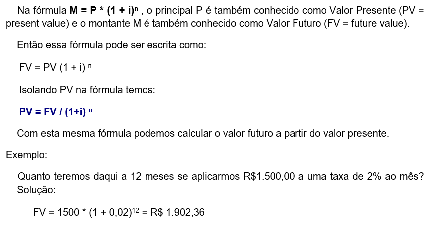
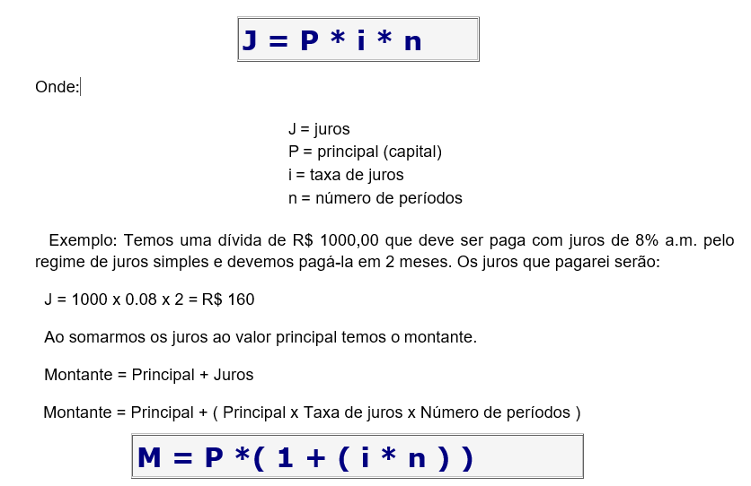
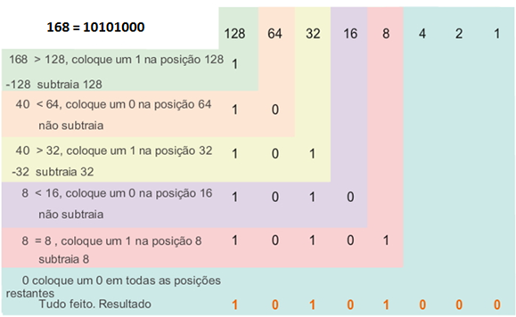

# Lista de exercícios obrigatórios - SEMANA 9

## Exercício 1 - VALOR PRESENTE E VALOR FUTURO 
    

  Desenvolva um script em Javascript que calcule o valor presente ou o valor futuro dependendo de qual opção o usuário escolher.

## Exercício 2 - JUROS SIMPLES
Utilize Javascript para resolver o problema a seguir, fazendo com que sejam calculados a montante (M) e o Juros (J), sendo dados pelo usuário o período (n), o capital (P) e a taxa de juros (i). Observe e utilize os exemplos abaixo para testar.

O regime de juros será simples quando o percentual de juros incidir apenas sobre o valor principal. Sobre os juros gerados a cada período não incidirão novos juros. Valor Principal ou simplesmente principal é o valor inicial emprestado ou aplicado, antes de somarmos os juros. Transformando em fórmula temos:
 
 
  
Exemplo: Calcule o montante resultante da aplicação de R$70.000,00 à taxa de 10,5% a.a. durante 145 dias.

SOLUÇÃO:
 M = P * ( 1 + (i*n) )
 M = 70000 [1 + (10,5/100).(145/360)] = R$72.960,42

Observe que expressamos a taxa i e o período n, na mesma unidade de tempo, ou seja, anos. Daí ter dividido 145 dias por 360, para obter o valor equivalente em anos, já que um ano comercial possui 360 dias.

Fonte: http://www.somatematica.com.br/emedio/finan2.php

## Exercício 3 - IMPRESSÃO MALUCA
Desenvolva um script que faça a impressão de um caracter por linha da frase que for digitada pelo usuário, de acordo com o exemplo abaixo.

ENTRADA: I love JS

SAÍDA:
<pre>
I
 
  l
   o
    v
     e
      
       J
        S
</pre>

## Exercício 4 - CONVERSÃO DECIMAL-BINÁRIO

Utilizando o algoritmo a seguir, desenvolva um script em Javascript que converta um número natural (decimal) inserido pelo usuário, na base dois (binário).
Obs: considerar um número no máximo de 8 bits, isto é, até 255 (base decimal). 

